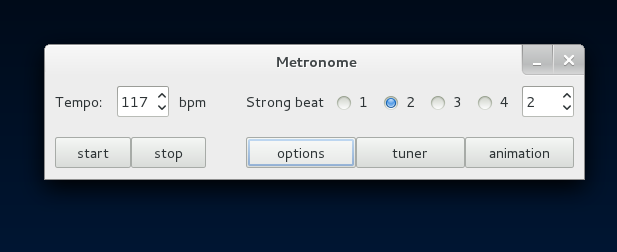
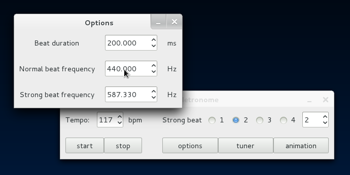
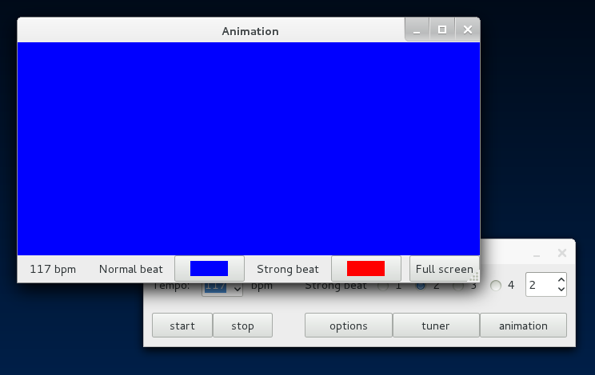
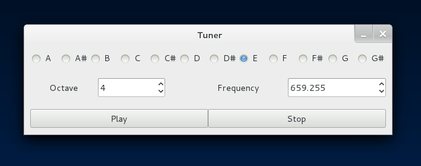

# Welcome

Hi there, this is where the documentation for the program will be.

If you have any question/suggestion/whatever, please create an issue instead of editing this (unless its something related to the documentation itself -- missing parts or spelling errors for example).

## Platforms

This program depends on gtkmm3 and gstreamermm-0.10, and since these are only available on linux, it isn't possible to run the program elsewhere (like windows).

We'll have to wait :(

# Installing

## Dependencies

You'll need to install automake and autoconf, to be able to compile the code.

This program also depends on gtkmm3 and gstreamer-0.10, so you'll need both the library and the development files.

## Compiling

Download the code, open a console in that folder and write:

* **autoreconf --force --install**
* **./configure**
* **make**

It will be created an executable file (among other things) named metronome, which you use to start the program.

# Here's some pictures

